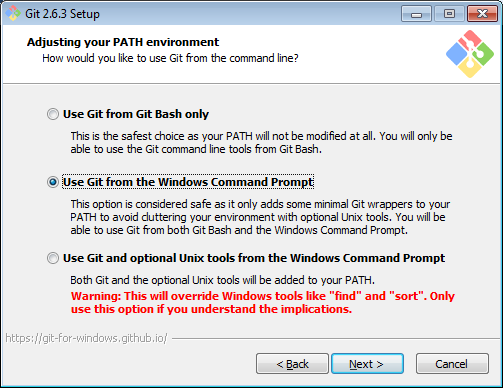
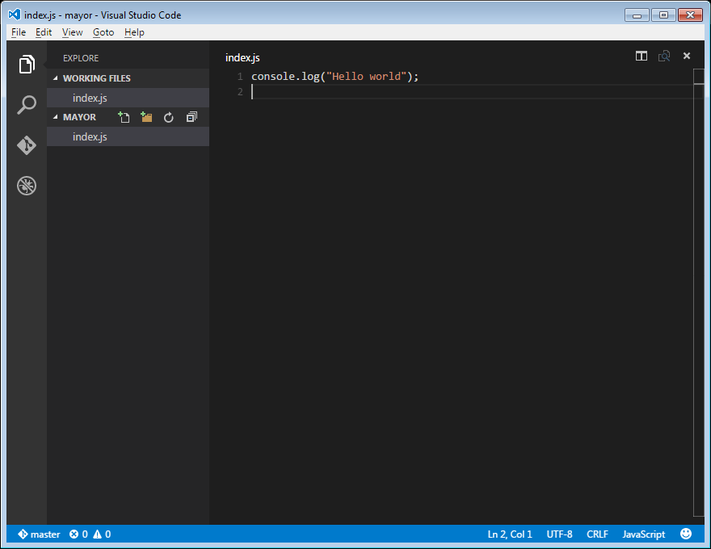
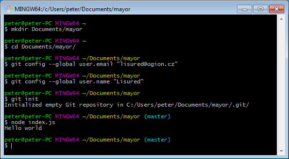

Nejdůležitější nástroj vývojáře je textový editor. V tomto kurzu budeme používat [VS Code](https://code.visualstudio.com/), který má ve výchozím nastavení zabudovanou podporu gitu i ladění node.js.

Dále budeme potřebovat [node.js](https://nodejs.org/en/download/) a [git](https://git-for-windows.github.io/). Při instalaci gitu ještě zvolíme „Use Git from the Windows Command Prompt“.



Po instalaci spustíme Git Bash. Vytvoříme složku, kde bude náš projekt a pomocí příkazu `cd` (**c**hange **d**irectory) do ní v Bashi přejdeme. Nakonec nastavíme git trojicí příkazů.

```bash
git config --global user.email "lisured@ogion.cz"
git config --global user.name "Lisured"
git init
```


Teď už se můžeme vrhnout do prvního projektu. Spustíme VS Code a otevřeme v něm složku, kterou jsme předtím vytvořili. Tam přidáme soubor `index.js`

```javascript
console.log("Hello world");
```



Pokud šlo vše podle plánu, můžeme svůj první javascriptový program spustit napsáním `node index.js`.



V další kapitole se pustíme do jednoduchého [web serveru](02-web-server.md).
